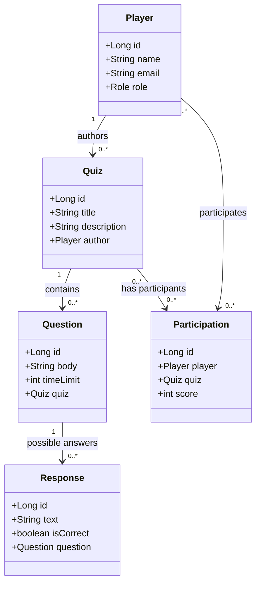
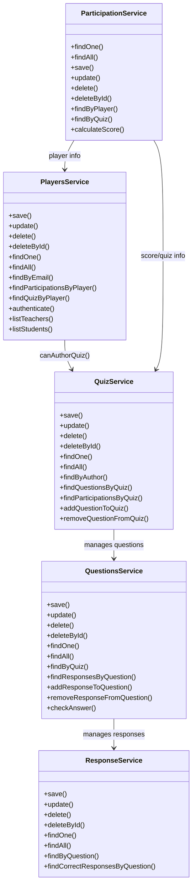
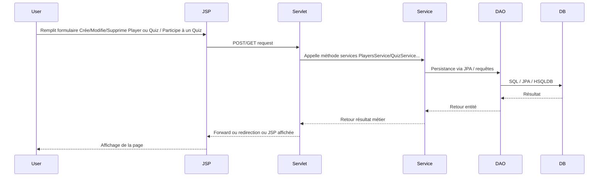
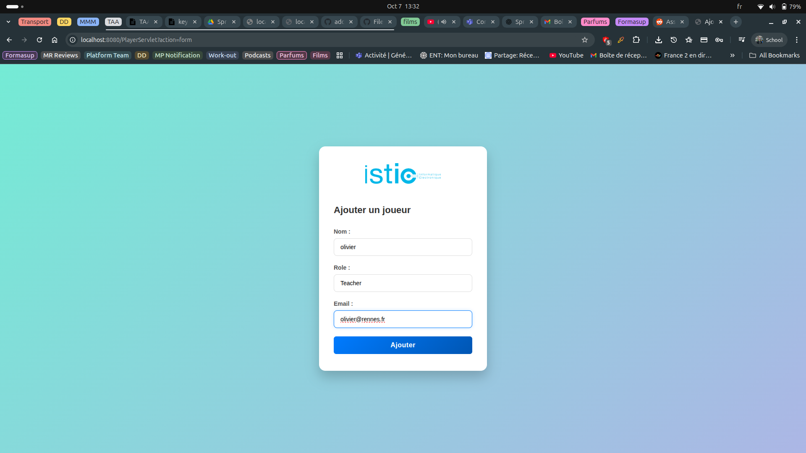
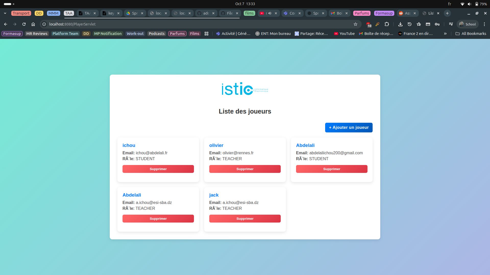
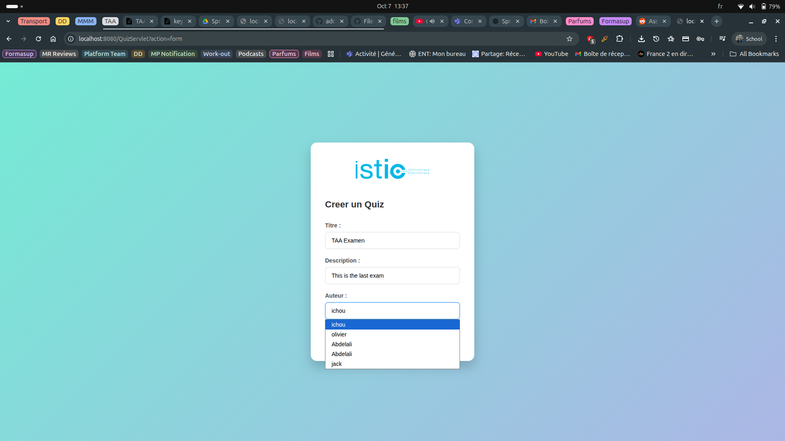
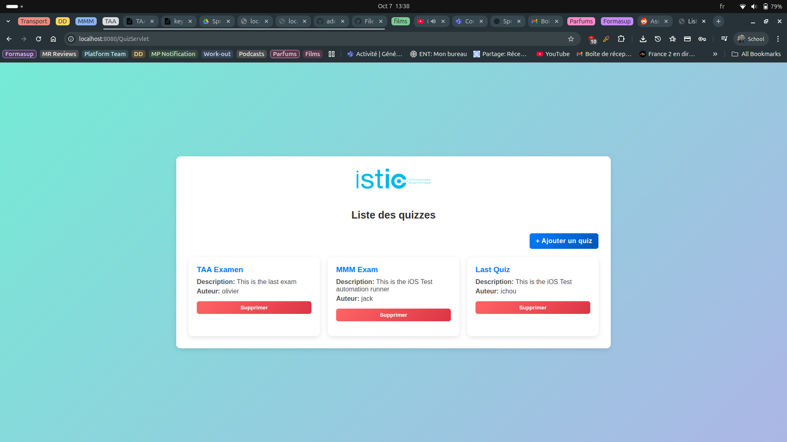
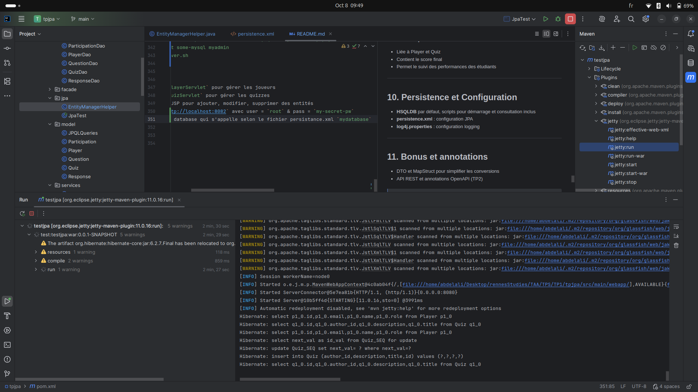
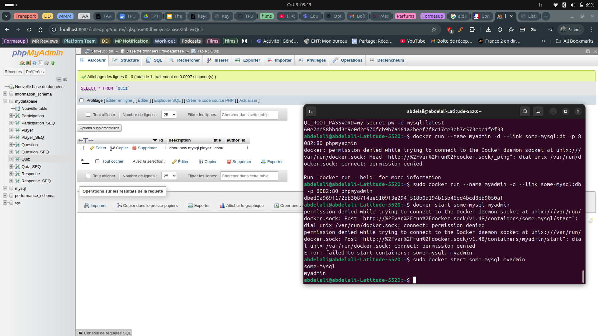

---

# Projet TP1-2 : Gestion de Quiz avec JPA et Servlets

## 1. Introduction

Ce projet constitue les TP1 et TP2 du cours. Il implémente un système de gestion de quiz avec :

* Une **base de données relationnelle** (HSQLDB par défaut)
* La **couche JPA** pour la persistance
* Des **servlets** pour le traitement des requêtes HTTP
* Une interface web utilisant **JSP/HTML/CSS**
* Les concepts de **DAO, Service, DTO, et MVC**


---

## 2. Structure du projet

```
pom.xml                  # Configuration Maven
hsqldb-2.7.2.jar         # Driver HSQLDB
run-hsqldb-server.sh/.bat # Scripts pour démarrer HSQLDB
show-hsqldb.sh/.bat      # Scripts pour ouvrir la DB HSQLDB
src/main/java
 ├─ dao/                 # Implémentation DAO JPA
 ├─ facade/              # Interfaces DAO abstraites
 ├─ jpa/                 # Gestion de l'EntityManager
 ├─ model/               # Entités JPA
 ├─ services/            # Logique métier
 └─ servlets/            # Couche web (HTTP endpoints)
src/main/resources
 ├─ log4j.properties     # Configuration log4j
 └─ persistence.xml      # Configuration JPA
src/main/webapp
 ├─ JSPs: allPlayers.jsp, allQuizzes.jsp, playerForm.jsp, quizForm.jsp
 ├─ HTML forms: myform.html, questionForm.html
 ├─ CSS: allPlayersForm.css, playerForm.css, myform.css, userInfo.css
 ├─ Images: istic.png
 └─ Static HTML: index.html
```

---

## 3. Entités et relations (modèle)

### 3.1. Diagramme Mermaid : relations principales



---

### 3.3 Diagramme des services pour chaque entité


---

### 3.2. Description des entités

| Entité        | Description                         | Relations                                                            | Règles Métier                     |
| ------------- | ----------------------------------- | -------------------------------------------------------------------- | --------------------------------- |
| Player        | Utilisateur (STUDENT ou TEACHER)    | Peut créer des quizzes (TEACHER), participer à des quizzes (STUDENT) | Email unique, rôle obligatoire    |
| Quiz          | Quiz créé par un Player             | Contient Questions, lié aux Participations                           | Seul un TEACHER peut être auteur  |
| Question      | Question appartenant à un Quiz      | Contient Responses                                                   | Temps limite pour répondre        |
| Response      | Réponse possible pour une Question  | Liée à Question                                                      | Indique si correcte               |
| Participation | Participation d’un Player à un Quiz | Relie Player et Quiz                                                 | Score calculé après participation |

---

## 4. Couche DAO et Facade

### 4.1. Interfaces DAO (`facade/`)

| Interface        | Description                                                                     |
| ---------------- | ------------------------------------------------------------------------------- |
| IGenericDao      | CRUD générique (`findOne`, `findAll`, `save`, `update`, `delete`, `deleteById`) |
| PlayerDao        | CRUD spécifique Player                                                          |
| QuizDao          | CRUD spécifique Quiz                                                            |
| QuestionDao      | CRUD spécifique Question                                                        |
| ResponseDao      | CRUD spécifique Response                                                        |
| ParticipationDao | CRUD spécifique Participation                                                   |

### 4.2. Implémentations DAO (`dao/`)

* `AbstractJpaDao` : base générique pour toutes les entités
* `PlayerDao`, `QuizDao`, `QuestionDao`, `ResponseDao`, `ParticipationDao` : implémentent leurs interfaces via `AbstractJpaDao`

---

## 5. Services (logique métier)

### 5.1. PlayersService

* CRUD complet sur Player
* Logique métier pour rôles :

  * TEACHER : peut créer des quizzes
  * STUDENT : peut participer à des quizzes
* Méthodes principales :  `save`, `update`,`delete`,`deleteById`,`findOne`,`findAll`,
`findByEmail`,`findParticipationsByPlayer`,`findQuizByPlayer`,`authenticate`,
`listTeachers`,`listStudents`

### 5.2. QuizService

* CRUD complet sur Quiz
* Filtrage par auteur (Player)
* Méthodes principales :  `save`, `update`,`delete`,`deleteById`,`findOne`,`findAll`,
  `findByAuthor`,`findQuestionsByQuiz`,`findParticipationsByQuiz`,
  `addQuestionToQuiz`,`removeQuestionFromQuiz`

### 5.3. QuestionsService / ResponseService / ParticipationService

* CRUD et logique métier similaire pour chaque entité

---

## 6. Flux Servlet → Service → DAO → Modèle -> BDD ...



---

## 7. Servlets et Web Layer

| Servlet         | URL                          | Actions principales        | Service utilisé  | Vue JSP/HTML                   |
| --------------- | ---------------------------- | -------------------------- | ---------------- | ------------------------------ |
| PlayerServlet   | `/PlayerServlet`             | list, create, edit, delete | PlayersService   | allPlayers.jsp, playerForm.jsp |
| QuizServlet     | `/QuizServlet`               | list, create, edit, delete | QuizService      | allQuizzes.jsp, quizForm.jsp   |
| QuestionServlet | `/QuestionServlet`           | CRUD questions             | QuestionsService | questionForm.jsp               |
| TestServlets    | `/FirstServlet`, `/UserInfo` | Tests / formulaires        | -                | HTML forms                     |

---

### 7.1. Interaction entre Servlets

* PlayerServlet peut rediriger vers QuizServlet pour afficher les quizzes d’un auteur :

```html
<a href="QuizServlet?authorId=${player.id}">Voir ses quizzes</a>
```

* Logique métier appliquée côté Service (ex : seulement un TEACHER peut être auteur d’un quiz)

---

## 8. Couche Web (JSP/HTML/CSS)

* **JSP** : affichage dynamique des listes et formulaires (`allPlayers.jsp`, `allQuizzes.jsp`, `playerForm.jsp`, `quizForm.jsp`)
* **HTML** : formulaires statiques pour tests de TP (`myform.html`, `questionForm.html`)
* **CSS** : styles pour formulaires et listes (`allPlayersForm.css`, `playerForm.css`, `myform.css`, `userInfo.css`)
* **Images** : logo ISTIC (`istic.png`)

Exemple : Screenshots des pages jsp quiz/player ... :






---

## 8. Lombok pour la Rédondance de Code

**Exemple pour l'Entité `Player` :**

```java
package com.example.springtp.domain;

import jakarta.persistence.*;
import lombok.*;

// ... autres imports ...

@Entity
@Getter // Génère tous les getters
@Setter // Génère tous les setters
@NoArgsConstructor // Requis par JPA pour la création de proxy
@ToString(exclude = {"quizzes", "participations"}) // Exclut les collections de la méthode toString()
@EqualsAndHashCode(exclude = {"quizzes", "participations"}) // Exclut les collections de equals/hashCode
@AllArgsConstructor // Constructeur avec tous les arguments
public class Player implements Serializable {

    @Id
    @GeneratedValue
    private Long id;

    @Column(length = 100)
    private String name;
    private String role;
    private String email;

    // Relations exclues de ToString et EqualsAndHashCode :
    @OneToMany(mappedBy = "author", cascade = CascadeType.ALL)
    private List<Quiz> quizzes = new ArrayList<>();

    @OneToMany(mappedBy = "player", cascade = CascadeType.ALL)
    private List<Participation> participations = new ArrayList<>();

    // Constructeur personnalisé conservé
    public Player(String name, String role, String email) { /* ... */ }
}
```

* **`@Getter`, `@Setter`**: Remplacent toutes les méthodes d'accès manuelles.
* **`@NoArgsConstructor`**: Indispensable pour la création d'instances par JPA.
* **`@ToString(exclude = {..})`** et **`@EqualsAndHashCode(exclude = {..})`**: Ces exclusions sont **obligatoires** sur les relations bidirectionnelles pour garantir la stabilité de l'application (prévention de l'exception `StackOverflowError` et des problèmes de *Lazy Loading*).

-----

---

## 9. Logique métier détaillée

### 9.1. Players

* TEACHER :

  * Peut créer des quizzes
  * Peut être sélectionné comme auteur
* STUDENT :

  * Peut participer aux quizzes
  * Ne peut pas être auteur

### 9.2. Quizzes

* Contient Questions et réponses possibles
* Lié à un Player (auteur)
* Participation et score calculé côté ParticipationService

### 9.3. Participation

* Liée à Player et Quiz
* Contient le score final
* Permet le suivi des performances des étudiants

---

## 10. Persistence et Configuration

* **HSQLDB** par défaut, scripts pour démarrage et consultation inclus
* **persistence.xml** : configuration JPA
* **log4j.properties** : configuration logging

---

## 11. Bonus et annotations

* DTO et MapStruct pour simplifier les conversions
* API REST et annotations OpenAPI (TP2)

<div style="background-color: rgb(150, 50, 50);">

> **Note importante :**  
> MapStruct et Swagger (OpenAPI) ne sont pas utilisés dans ce TP1.  
> Ces fonctionnalités seront introduites dans les TP2 (OpenAPI) et TP3 (Spring).

</div>

---

## 12. Lancer l'application avec docker

```
docker compose up --build
```

1. Accéder à `http://localhost:9000/PlayerServlet` pour gérer les joueurs
2. Accéder à `http://localhost:9000/QuizServlet` pour gérer les quizzes
3. Utiliser les JSP pour ajouter, modifier, supprimer des entités
4. Accéder à `http://localhost:8082` avec user = `root` & pass = `my-secret-pw`
5. Crée nouvelle database qui s'appelle selon le fichier persistance.xml `mydatabase`

Exemple : Screenshots aprés lancement de tout ... :




---
